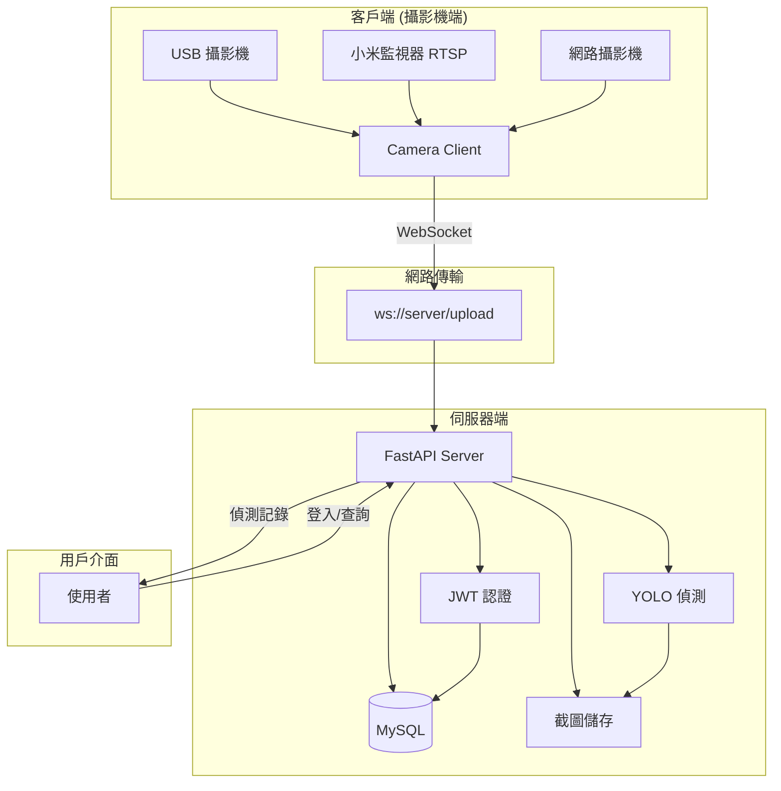
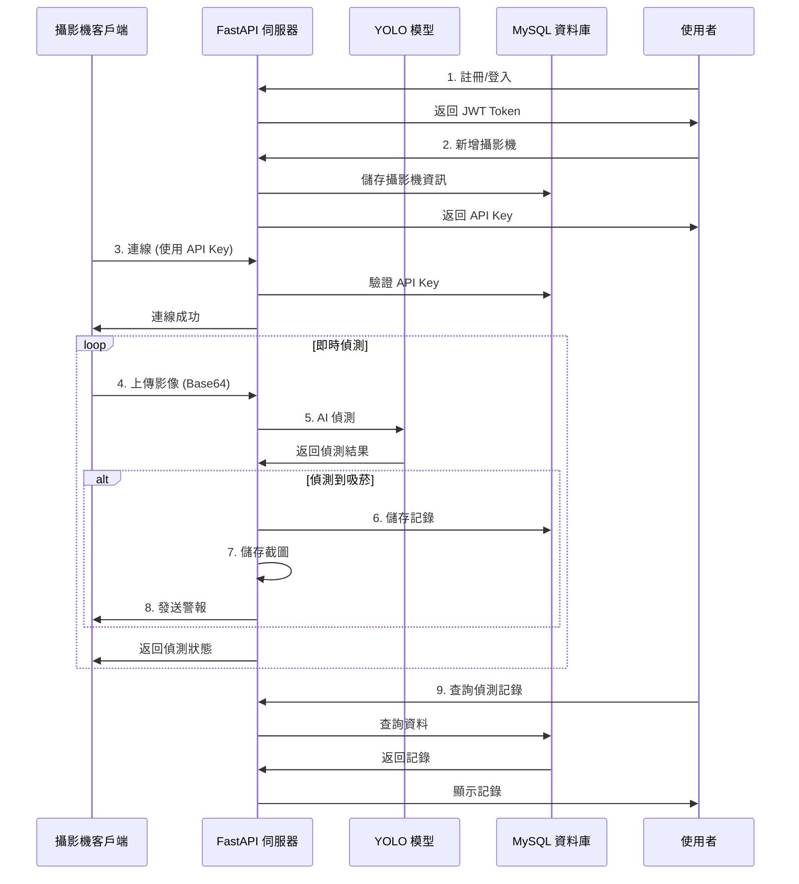
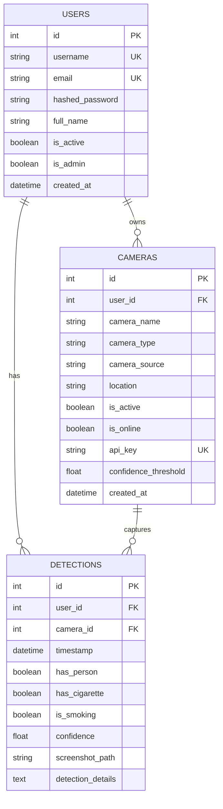
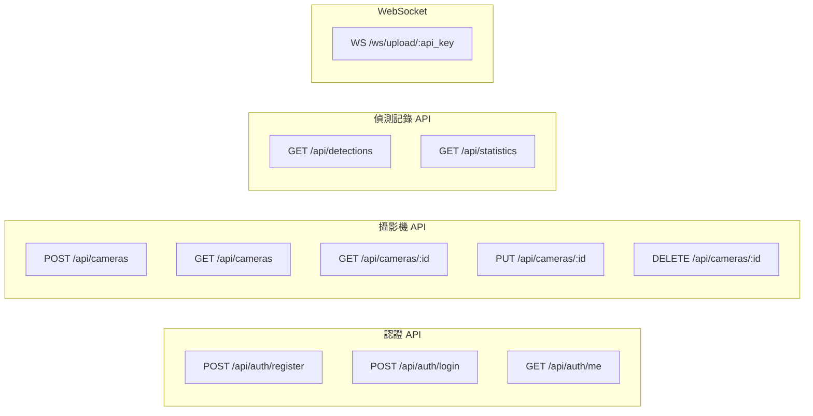
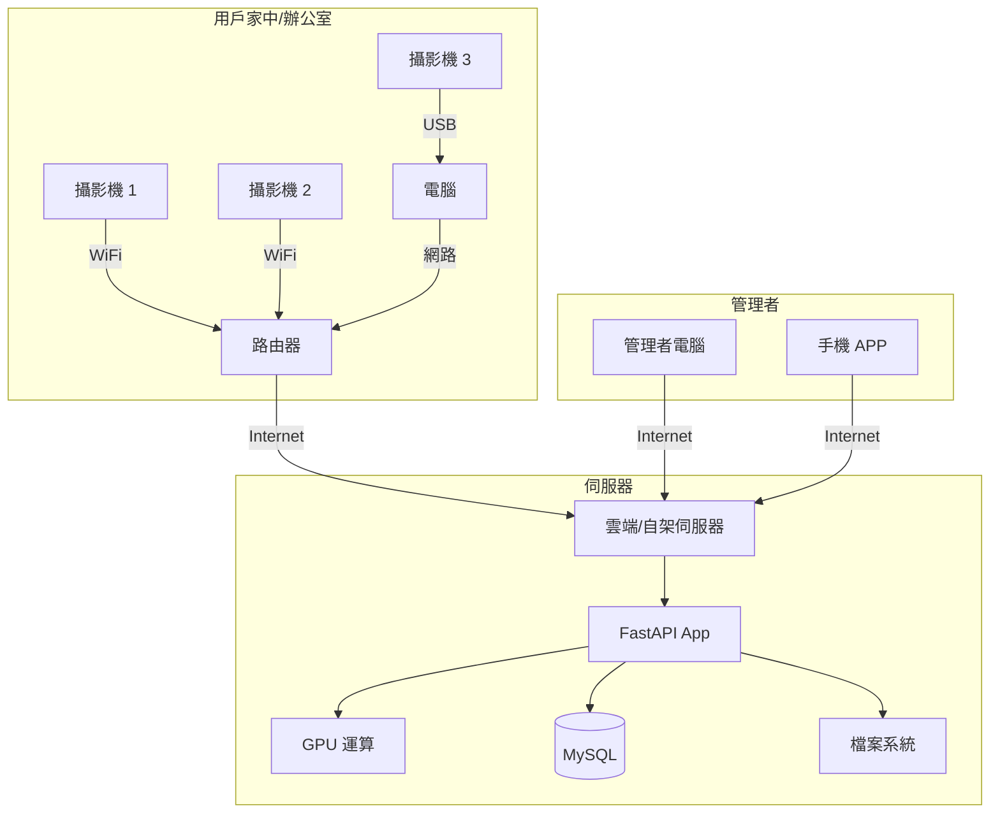

# 系統架構圖

## 整體架構

```mermaid
graph TB
    subgraph "客戶端 (攝影機端)"
        A1[USB 攝影機] --> C1[Camera Client]
        A2[小米監視器 RTSP] --> C1
        A3[網路攝影機] --> C1
    end
    
    subgraph "網路傳輸"
        C1 -->|WebSocket| WS[ws://server/upload]
    end
    
    subgraph "伺服器端"
        WS --> API[FastAPI Server]
        API --> AUTH[JWT 認證]
        API --> AI[YOLO 偵測]
        API --> DB[(MySQL)]
        API --> STORAGE[截圖儲存]
        
        AUTH --> DB
        AI --> STORAGE
    end
    
    subgraph "用戶介面"
        USER[使用者] -->|登入/查詢| API
        API -->|偵測記錄| USER
    end
```

## 資料流程

```mermaid
sequenceDiagram
    participant Client as 攝影機客戶端
    participant Server as FastAPI 伺服器
    participant AI as YOLO 模型
    participant DB as MySQL 資料庫
    participant User as 使用者
    
    User->>Server: 1. 註冊/登入
    Server->>User: 返回 JWT Token
    
    User->>Server: 2. 新增攝影機
    Server->>DB: 儲存攝影機資訊
    Server->>User: 返回 API Key
    
    Client->>Server: 3. 連線 (使用 API Key)
    Server->>DB: 驗證 API Key
    Server->>Client: 連線成功
    
    loop 即時偵測
        Client->>Server: 4. 上傳影像 (Base64)
        Server->>AI: 5. AI 偵測
        AI->>Server: 返回偵測結果
        
        alt 偵測到吸菸
            Server->>DB: 6. 儲存記錄
            Server->>Server: 7. 儲存截圖
            Server->>Client: 8. 發送警報
        end
        
        Server->>Client: 返回偵測狀態
    end
    
    User->>Server: 9. 查詢偵測記錄
    Server->>DB: 查詢資料
    DB->>Server: 返回記錄
    Server->>User: 顯示記錄
```

## 資料庫結構

```mermaid
erDiagram
    USERS ||--o{ CAMERAS : owns
    USERS ||--o{ DETECTIONS : has
    CAMERAS ||--o{ DETECTIONS : captures
    
    USERS {
        int id PK
        string username UK
        string email UK
        string hashed_password
        string full_name
        boolean is_active
        boolean is_admin
        datetime created_at
    }
    
    CAMERAS {
        int id PK
        int user_id FK
        string camera_name
        string camera_type
        string camera_source
        string location
        boolean is_active
        boolean is_online
        string api_key UK
        float confidence_threshold
        datetime created_at
    }
    
    DETECTIONS {
        int id PK
        int user_id FK
        int camera_id FK
        datetime timestamp
        boolean has_person
        boolean has_cigarette
        boolean is_smoking
        float confidence
        string screenshot_path
        text detection_details
    }
```

## API 端點結構

```mermaid
graph LR
    subgraph "認證 API"
        A1[POST /api/auth/register]
        A2[POST /api/auth/login]
        A3[GET /api/auth/me]
    end
    
    subgraph "攝影機 API"
        B1[POST /api/cameras]
        B2[GET /api/cameras]
        B3[GET /api/cameras/:id]
        B4[PUT /api/cameras/:id]
        B5[DELETE /api/cameras/:id]
    end
    
    subgraph "偵測記錄 API"
        C1[GET /api/detections]
        C2[GET /api/statistics]
    end
    
    subgraph "WebSocket"
        D1[WS /ws/upload/:api_key]
    end
```

## 部署架構

```mermaid
graph TB
    subgraph "用戶家中/辦公室"
        CAM1[攝影機 1] -->|WiFi| ROUTER[路由器]
        CAM2[攝影機 2] -->|WiFi| ROUTER
        CAM3[攝影機 3] -->|USB| PC[電腦]
        PC -->|網路| ROUTER
    end
    
    ROUTER -->|Internet| CLOUD[雲端/自架伺服器]
    
    subgraph "伺服器"
        CLOUD --> APP[FastAPI App]
        APP --> GPU[GPU 運算]
        APP --> MYSQL[(MySQL)]
        APP --> FILES[檔案系統]
    end
    
    subgraph "管理者"
        ADMIN[管理者電腦] -->|Internet| CLOUD
        MOBILE[手機 APP] -->|Internet| CLOUD
    end
```
